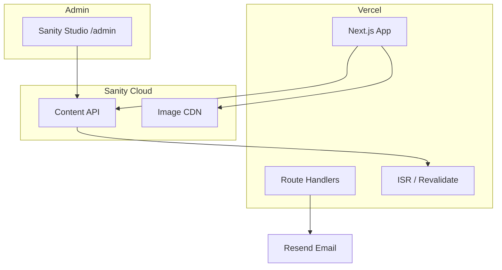

# HeyCoco Website — Backend Plan

This document plans how to add a backend so the marketing site can be updated without editing TypeScript files.

## Goals

- Edit projects, team, news, testimonials, FAQ, and site settings from an admin UI
- Upload images to cloud storage (not committed to git)
- Keep the public site fast (static/ISR on Vercel)
- Reuse existing HeyCoco infrastructure where possible (`client-management-portal`, `weare@heycoco.agency`)

---

## Recommended stack

| Layer | Choice | Why |
|-------|--------|-----|
| CMS / Admin | **Sanity** or **Payload CMS** | Structured content, image CDN, good Next.js integration |
| Database | Postgres (Payload) or Sanity Cloud | Payload if you want self-hosted; Sanity if you want zero ops |
| Media | Sanity CDN / Vercel Blob / S3 | Optimized images for portfolio |
| API | Next.js Route Handlers + CMS client | Already on Vercel |
| Auth (admin) | Clerk or NextAuth | Protect `/admin` routes |
| Contact form | Keep Resend (existing) | Store submissions in DB as optional Phase 2 |

**Recommendation for HeyCoco:** **Sanity** — fastest path for a marketing site, excellent image pipeline, free tier sufficient for v1.

---

## Content model (maps to current `content/` files)

```
SiteSettings (singleton)
  - name, email, phone, location, whatsapp
  - social links (instagram, linkedin, clutch, etc.)
  - hero headline, subheadline, intro text
  - clutch rating text

Project
  - title, slug, category, tags[], date
  - featured (boolean), sortOrder
  - image (asset), description

Testimonial
  - quote, name, role, company, avatar, sortOrder

TeamMember
  - name, role, image, social links, sortOrder

NewsPost
  - title, slug, excerpt, date, featured, image

FaqItem
  - question, answer, sortOrder

Award (hero carousel)
  - title, icon or image, sortOrder

ProcessStep
  - title, description, sortOrder

ProcessStat
  - value, label
```

---

## Architecture



### Data flow (public site)

1. `app/page.tsx` fetches content via `lib/cms.ts` (Sanity client)
2. Responses cached with `revalidate: 60` (ISR) or on-demand webhook
3. Components receive same shapes as current `content/*.ts` types
4. Images served from Sanity CDN through `next/image` remote patterns

### Data flow (content update)

1. Editor publishes in Sanity Studio
2. Sanity webhook → `POST /api/revalidate`
3. Next.js revalidates `/` and affected paths

---

## Migration phases

### Phase 1 — CMS setup (1–2 days)
- Create Sanity project + schemas matching content model above
- Add `sanity` client in `lib/sanity/`
- Migrate seed data from `content/*.ts` into Sanity
- Swap one section (e.g. Projects) to prove fetch works

### Phase 2 — Full content migration (2–3 days)
- Replace all `content/*.ts` imports with CMS fetchers
- Add `remotePatterns` for Sanity images in `next.config.ts`
- Configure ISR + webhook revalidation
- Deploy Sanity Studio at `heycoco.agency/admin` or `studio.heycoco.agency`

### Phase 3 — Admin polish (1–2 days)
- Auth on Studio or custom admin
- Preview mode for draft content
- Form submissions table (optional: Supabase/Postgres)

### Phase 4 — Optional extensions
- Project detail pages `/projects/[slug]`
- Blog with MDX from Sanity
- Indonesian/English locale fields
- Integration with `client-management-portal` for client logos/testimonials

---

## File changes (frontend)

```
lib/
  sanity/
    client.ts          # Sanity client + fetch helpers
    queries.ts         # GROQ queries
    types.ts           # Generated or hand-written types
  cms.ts               # Unified getProjects(), getSite(), etc.

app/
  api/
    revalidate/route.ts  # Sanity webhook
    contact/route.ts       # (existing)

content/                 # Keep as fallbacks OR remove after migration
```

Example fetch pattern:

```typescript
// lib/cms.ts
export async function getProjects() {
  return sanityFetch<Project[]>(PROJECTS_QUERY, { revalidate: 60 });
}
```

```typescript
// app/page.tsx
export default async function Home() {
  const [projects, testimonials, ...] = await Promise.all([
    getProjects(),
    getTestimonials(),
    // ...
  ]);
  return <HomePage projects={projects} ... />;
}
```

Pages become **Server Components** that pass data to existing section components as props.

---

## API routes

| Route | Method | Purpose |
|-------|--------|---------|
| `/api/contact` | POST | Contact form → Resend (exists) |
| `/api/revalidate` | POST | Sanity webhook → `revalidatePath('/')` |
| `/api/draft` | GET | Preview mode entry (Phase 3) |

---

## Environment variables

```env
# Existing
RESEND_API_KEY=
CONTACT_TO_EMAIL=

# Sanity
NEXT_PUBLIC_SANITY_PROJECT_ID=
NEXT_PUBLIC_SANITY_DATASET=production
SANITY_API_TOKEN=           # server-only, read + webhook
SANITY_REVALIDATE_SECRET=   # webhook auth

# Optional admin auth
CLERK_SECRET_KEY=
```

---

## Alternative: Payload CMS (self-hosted)

Use if you want everything in one repo + Postgres on Neon/Railway:

- `payload.config.ts` in monorepo
- Admin at `/admin`
- Collections mirror Sanity schemas above
- Heavier setup, more control, no vendor lock-in for content

---

## Alternative: Extend client-management-portal

If you already have a portal with client/project data:

- Expose read-only API from portal for public website
- Website fetches portfolio + testimonials from portal DB
- Single source of truth for client work
- Requires API design between two apps

---

## Success criteria

- [ ] Non-developer can add/edit a project without code deploy
- [ ] Image upload works from admin
- [ ] Site updates within 60s of publish (or instant with webhook)
- [ ] Lighthouse scores unchanged
- [ ] Contact form still works

---

## Next step

Choose CMS (Sanity recommended) and confirm:
1. Who will edit content (1 person vs team)?
2. Need draft/preview before publish?
3. Should portfolio sync with `client-management-portal`?

Then implement **Phase 1** in a branch `feat/sanity-cms`.
